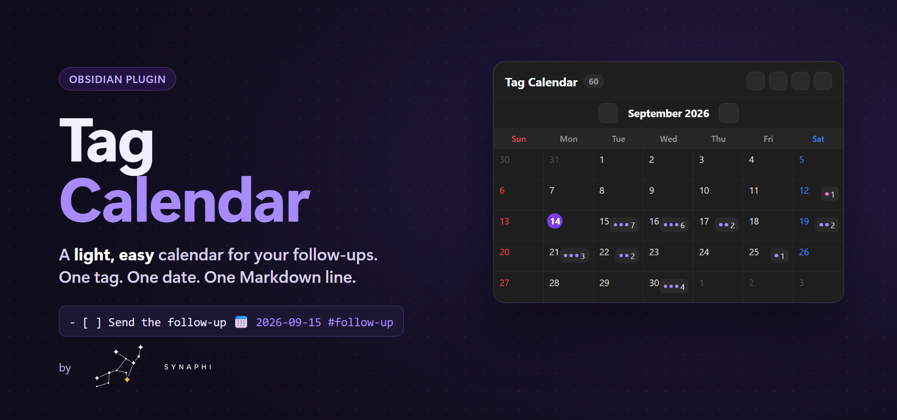
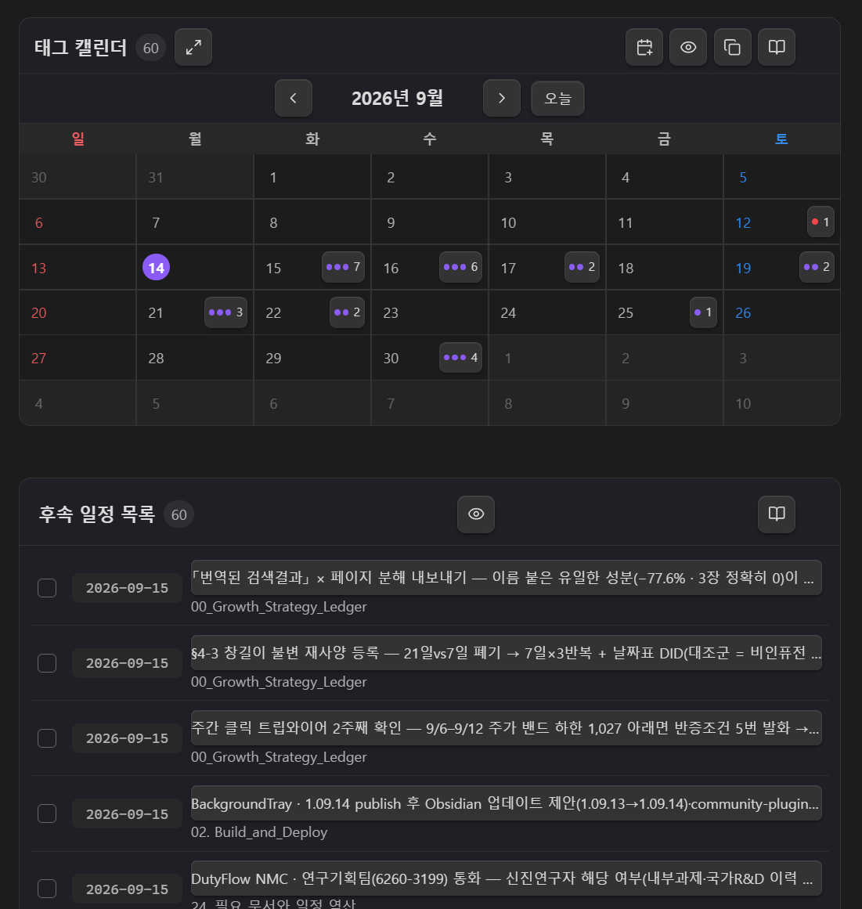
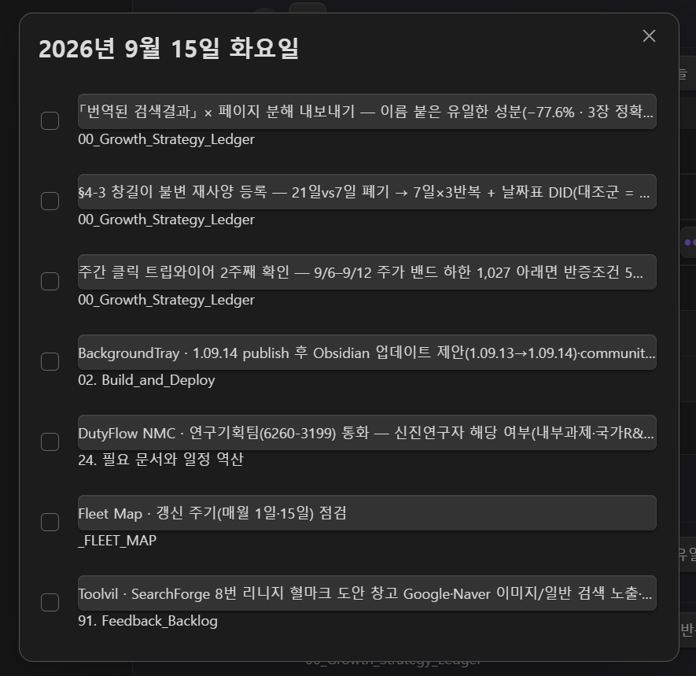

<a href="assets/banner.png"></a>

# Tag Calendar

A light, easy calendar for Obsidian. Tag a task, give it a date, and it shows up on the calendar.

```markdown
- [ ] Send the follow-up email 📅 2026-09-15 #follow-up
```

That one Markdown line is the whole system. No database, no sync engine, no setup.

## Why you'll like it

- **One line, one place.** Your schedule lives in plain Markdown checkboxes. Edit the line, the calendar updates. Tick the calendar, the line updates.
- **One note to manage.** The plugin opens a single hub note (`_CALENDAR.md` by default). Add schedules there, or write the line in any note — both are picked up instantly.
- **Copy it anywhere.** Press **Copy** and paste a `tag-calendar` block into any note — your daily note, a project page, a dashboard. Every copy is live and shows the same data.
- **Light.** It only indexes lines that carry both `📅` and `#follow-up`, so it stays fast even in large vaults and never touches your other tasks.
- **Recurring, without clutter.** Add `🔁 daily`, `weekly`, `monthly:15`, or `yearly:09-15`. Completing an occurrence rolls the same line forward to the next date — no duplicated future tasks.

## Screens

Compact calendar with a nearest-first list underneath:

<p align="center">
  
</p>

Click a day to see everything due that day and tick items off:

<p align="center">
  
</p>

## How to use

1. Click the calendar icon in the left ribbon. The hub note opens (it's created once if missing).
2. Press **Add schedule**, or write a line yourself:
   `- [ ] Title 📅 YYYY-MM-DD #follow-up #optional-project-tag`
3. Press **Copy** in the calendar header and paste the block into any other note.

Live block options (all optional):

````markdown
```tag-calendar
weekStart: monday
showCompleted: false
density: compact
```
````

Use `tag-list` as the block name for the list view only.

## Settings

Language (follows Obsidian, or Korean / English), hub note path, first day of week, show completed by default, default calendar size. A built-in guide with update notes is one click away from the book icon.

## Feedback

This plugin is small on purpose, and I keep it that way. If something feels off or you're missing a small thing, [open an issue](https://github.com/Synaphi/tag-calendar/issues) — feedback is folded in quickly.

## Install manually

Download `main.js`, `manifest.json`, and `styles.css` from the latest release into `<vault>/.obsidian/plugins/tag-calendar/`, reload Obsidian, and enable **Tag Calendar**.

## Development

```bash
npm install
npm test
npm run build
npm run deploy:local -- C:\path\to\vault
```

Versions use the date form `<year index>.<MM>.<DD>` (`1.09.14` = 2026-09-14, second release on the
same day = `1.09.14.2`). Edit `manifest.json`, `package.json`, and `versions.json` by hand — `npm version`
normalizes `1.09.14` to `1.9.14` and breaks the release tag.

The banner is rendered from `assets/banner-source.html` with headless Chrome at 1280×600 (scale 1.5).

## License

MIT
